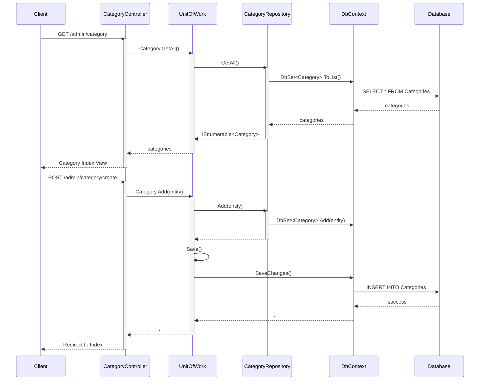

# InventoryControlSystem_MVC

A modern **ASP.NET Core MVC (.NET 8)** inventory management system built with **Entity Framework Core**, clean architecture principles, and full CRUD operations for products, categories, and stock tracking. Designed as a professional portfolio project demonstrating real-world MVC patterns, dependency injection, layered architecture, and database-first/EF Core workflows.

  
  
  

---

## 🚀 Features
- ASP.NET Core MVC (.NET 8)
- Entity Framework Core with SQL Server
- Clean, layered architecture (Controllers → Services → Data)
- Full CRUD for inventory entities
- Dependency Injection throughout the application
- Strong separation of concerns
- Responsive Razor Views
- Local SQL Server database integration

---

## 🛠️ Tech Stack
**Backend**
- ASP.NET Core MVC (.NET 8)
- C#
- Entity Framework Core
- SQL Server 25

**Frontend**
- Razor Views
- Bootstrap 5

**Tools**
- Visual Studio / VS Code
- SSMS
- Git & GitHub

